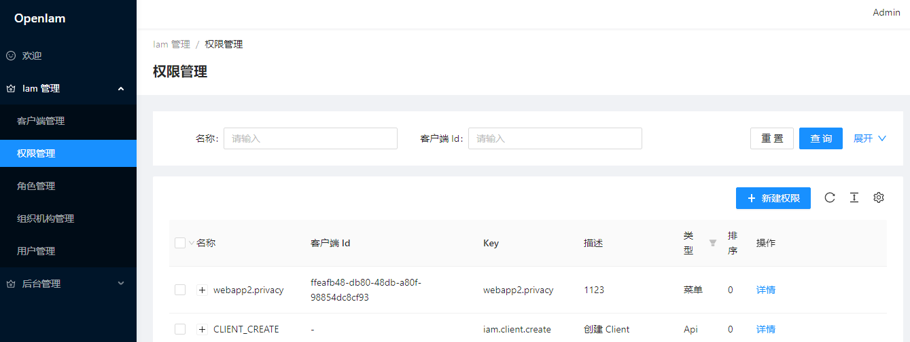
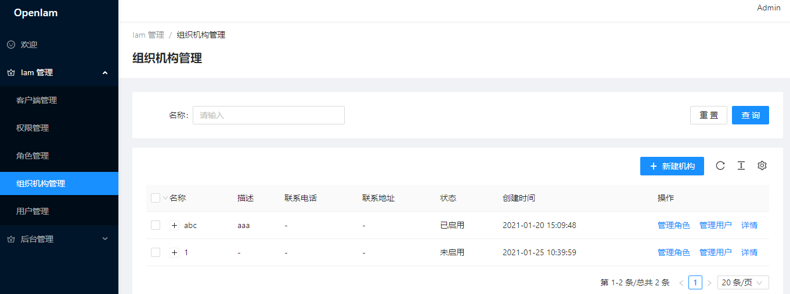
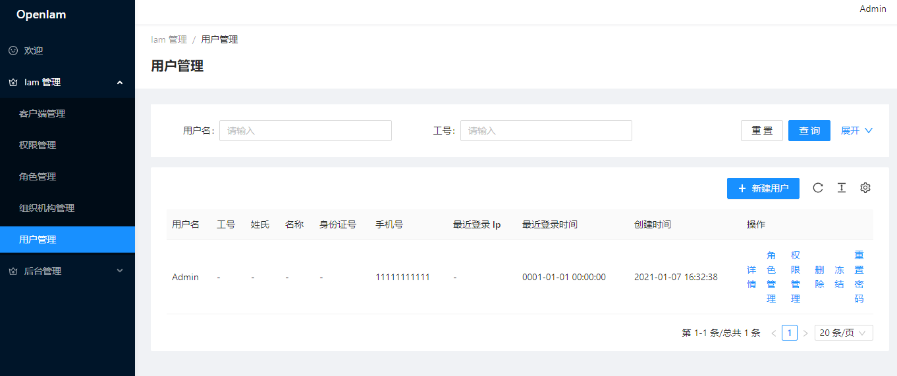
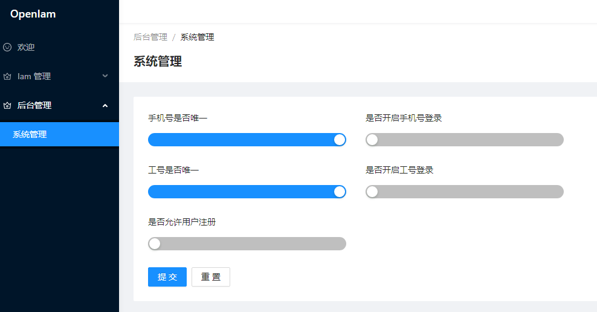

# OpenIam （Spa)
轻量级通用开源 Identity and Access Management (以下简称 Iam) 解决方案，用于满足企业内部各系统的单点登录（集成了 钉钉、企业微信、用户名、手机号、工号等多种方式）、用户管理、组织管理、授权管理的基本需求。    

**SPA** 版本，除了 "用户登录" 相关功能仍然基于 `Razor Page` 方式开发，其余所有管理页面均基于前后端分离模式实现，其中：

- 后端系统目前主要基于 `Asp.Net Core 3.1`, `EF Core 3.1`, `IdentityServer 4`, `Layui 2.5.7` 技术实现，使用 `Postgresql 13` 数据库。（注，后端系统已经提供 Layui 整套管理界面，因此可以和使用非 Spa 版本一样独立使用）
- Spa 主要基于 `And Design Pro v5`，`React 17.0.0` 实现，并基于 `Pkce` 模式与后端进行认证。


项目开发环境：

- Win 10 x64
- Visual Stuido 2019 v16.8.4、VS Code v1.52.1
- Node v12.18.4
- Docker v19.03.13


## 效果图
##### 登录（小屏）

采用 Razor Page

</img>

##### 登录（大屏）

采用 Razor Page

</img>

##### 首页
</img>

##### 客户端管理
</img>

##### 权限管理
</img>

##### 角色管理

</img>

##### 组织机构管理

</img>

##### 用户管理

</img>

##### 系统管理

</img>

## 功能说明
OpenIam 主要用于内部系统间的统一身份认证及权限管理，核心功能包括：客户端管理、用户管理、组织机构管理、授权管理。

#### 客户端管理
每个子系统如果需要接入 OpenIam，则必须先要在 OpenIam 中注册一个客户端，获取对应的 `Client Id`, `Client Secret`。如果客户端需要访问需要授权的 Api 服务，则可以把 Api 服务作为 Scope 天不假到客户端中，从而可以利用 OpenIam 进行统一鉴权。

OpenIam 目前只支持 `Code(Pkce)` 、`Credential`模式。

#### 用户管理
1. 提供用户名、手机号、工号登录方式，其中手机号、工号登录方式默认开启，可通过**系统管理**界面选择关闭
1. 集成钉钉、企业微信两种外部扫码登录方式，通过**工号**与用户进行关联
1. 可后台添加用户，也可以用户自主注册（默认关闭，可通过**系统管理**界面选择开启。用户自己注册后，必须要管理员激活才能登录）
1. 可对用户的所属组织、权限、角色进行控制

#### 组织机构管理
1. 提供组织机构的 CRUD 操作
1. 可管理组织中的用户
1. 可管理组织默认的角色（所有属于该组织的用户自动继承这些角色）

#### 授权管理
授权系统主要由权限、角色、组织机构 几块构成，其中 "权限" 为最细粒度的控制，角色用于对权限按照一定规则进行分组，组织机构可以包含一些默认的角色，只要属于该组织的用户则自动拥有某个角色（及该角色所拥有的权限）。   


## 使用说明
从 `Cookie` 安全的角度考虑，以及 Chrome 浏览器对 `SameSite` 的硬性要求，无论开发环境还是生产环境都要求支持 Https，否则登录相关功能将无法正常使用。

##### 准备工作

1. `git pull https://github.com/stg609/OpenIam` 

1. 安装 Postgres 数据库

1. 在 Postgres 中创建数据库，并执行 **Web\Infra\Scrips** 中的 `01_init.sql` 脚本对表结构进行配置       

   
### 一、开发调试环境

##### 运行后端

1. 使用 **Visual Studio 2019** 打开项目根目录的 **OpenIam.sln**，然后开始调试运行 （假设后端的地址为 https://localhost:5002)
2. 使用自带的 Layui 管理界面为 Spa 创建一个 Spa Client，填写**名称**和**客户端地址**，其他采用默认即可。（注，客户端地址需要填写Spa项目运行的地址，如：https://localhost:8000）


##### 运行前端

由于并非采用微软提供的 React 项目模板，因此我们需要手动来运行前端。

1. 在 **项目根目录\ClientApp** 文件夹中，使用命令行工具执行 `npm install`
2. 编辑 **项目根目录\ClientApp\public\appsettings.js** 文件 （该文件也可以在运行过程中修改，修改后刷新浏览器缓存立即生效）
    | Key                 | Value                                                        |
    | ------------------- | ------------------------------------------------------------ |
    | `Authority`         | 填写 OpenIam 后端的地址，如 https://localhost:5002           |
    | `ClientId`          | 填写 **Spa Client** 的 ClientId                              |
    | `PathBasePrefix`    | 用于当后端项目部署到虚拟目录的时候使用，开发环境可以直接留空 |
    | `SigninPathSegment` | 采用默认的 signin                                            |
    | `FrontEndHost`      | 填写前端项目的运行地址，如 https://localhost:8000            |

1. 执行 `npm run start`


### 二、测试环境

为了避免 SPA 跨域的问题，本文采用 **Nginx** 反向代理方式进行部署。

#### 编译方式

如果对代码进行了调整，或者希望更好的控制代码的部署方式，可以选择直接对项目源码进行编译发布的方式。

##### 发布后端

1. 使用 **Visual Studio 2019** 打开项目根目录的 **OpenIam.sln**，选择 **Web** 项目，右键单击 **发布**，其中的 **配置** 选择 **Release**、**部署模式** 及 **目标运行时** 可根据情况进行选择。

2. 发布后，通过配置文件对数据库、钉钉、企业微信、日志进行调整，对应的配置文件为: appsettings.json 及 serilog.json，这里主要强调下 `IamOptions` 的配置

   | Key            | Value                                                        |
   | -------------- | ------------------------------------------------------------ |
   | `Host`         | 填写 OpenIam 后端的地址，由于我们采用 nginx 反向代理，这里填写前端地址如： https://localhost:8000/backend，其中 `backend` 为 nginx 中的二级目录名称 |
   | `ValidIssuers` | 填写合法的 Issuers，由于我们部署到 Nginx ，这里可以把 https://localhost:8000/backend 以及 https://locahost:5002 都加进去。 |
   | `PathBase`     | 用于当后端项目部署到虚拟目录的时候使用，这里填写 `/backend`  |

##### 发布前端

1. 在 **项目根目录\ClientApp** 文件夹打开命令行工具，执行 `npm run build`

2. 编辑 **项目根目录\ClientApp\public\appsettings.js** 文件

   | Key                 | Value                                                        |
   | ------------------- | ------------------------------------------------------------ |
   | `Authority`         | 填写 OpenIam 后端的地址，由于我们采用 nginx 反向代理，这里填写前端地址如： https://localhost:8000/backend，其中 `backend` 为 nginx 中的二级目录名称 |
   | `ClientId`          | 填写 **Spa Client** 的 ClientId                              |
   | `PathBasePrefix`    | 用于当后端项目部署到虚拟目录的时候使用，这里填写 `/backend`  |
   | `SigninPathSegment` | 采用默认的 signin                                            |
   | `FrontEndHost`      | 填写前端项目的运行地址，如 https://localhost:8000            |

##### 配置 nginx

1. 打开 nginx.conf，复制如下内容：

   ```
   # 后端项目地址
   upstream IdSrv {
       include /etc/nginx/upstream.conf;
   }
   
   server {
       listen 443 ssl;
   		
       # gzip config
       gzip on;
       gzip_min_length 1k;
       gzip_comp_level 9;
       gzip_types text/plain application/javascript application/x-javascript text/css application/xml text/javascript application/x-httpd-php image/jpeg image/gif image/png;
       gzip_vary on;
       gzip_disable "MSIE [1-6]\.";
   	
       # 前端项目直接运行与 根目录
       location / {
           root   /usr/share/nginx/html; # Spa build 后的目录
           try_files $uri $uri/ /index.html;
       }
   
       # 后端项目位于 /backend 二级目录，用于前后端的隔离
       location /backend {
           proxy_pass $scheme://IdSrv;
           proxy_redirect     off;
           proxy_set_header   Upgrade $http_upgrade;
           proxy_set_header   Connection keep-alive;
           proxy_set_header   Host $host:$server_port;
           proxy_set_header   X-Real-IP $remote_addr;
           proxy_set_header   X-Forwarded-Host $host:$server_port;
           proxy_set_header   X-Forwarded-For $proxy_add_x_forwarded_for;
           proxy_set_header   X-Forwarded-Proto $scheme;
           proxy_cache_bypass $http_upgrade;
       }
   
       # ssl 证书相关配置，请替换成正式的证书
       ssl_certificate           /etc/nginx/ssl/openIam.crt;
       ssl_certificate_key       /etc/nginx/ssl/openIam.key;
       ssl_protocols             TLSv1.1 TLSv1.2;
       ssl_prefer_server_ciphers on;
       ssl_ciphers               "EECDH+AESGCM:EDH+AESGCM:AES256+EECDH:AES256+EDH";
       ssl_ecdh_curve            secp384r1;
       ssl_session_cache         shared:SSL:10m;
       ssl_session_tickets       off;
   }
   ```

   上面只是提供了一个基础配置，可以根据实际情况进行调整。

2.  编辑 **upstream.conf** ，该文件用于保存所有可用的后端服务地址，如：

   ```
   server localhost:5001;
   server localhost:5002;
   ```

##### 运行

1. 运行 后端 项目，可以通过 `.\Charlie.OpenIam.Web.exe` 启动

2. 启动 nginx ，如果已经启动则刷新 nginx 的配置 (`nginx -s reload`)

   

#### Docker 方式

如果只是希望快速直接试用，则推荐使用 Docker 方式

1. 启动后端
   
   ```
   docker run -p 5002:443 
      -v C:\Projects\Github\OpenIam\Web\appsettings.json:/app/appsettings.json 
      -e ASPNETCORE_ENVIRONMENT=Production 
      -e Certificate__Path=lics/idsrv4.pfx  
      -e "ASPNETCORE_URLS=https://+:443;" 
      stg609/openiam:spa-v1.1.0
   ```
    这个命令使用的是产品环境，并把容器中的 **443** 映射到了本机的 **5002** 端口。当命令成功执行后，会在控制台打印出当前正在监听的端口。
   
   
1. 启动前端

   ```
   docker run -p 8000:443 
   	-v C:/Projects/Github/OpenIam/ClientApp/public/appsettings.js:/usr/share/nginx/html/appsettings.js 
   	-v C:\Projects\Github\OpenIam\ClientApp\nginx-upstream.conf:/etc/nginx/upstream.conf 
   	-v C:\Projects\Github\OpenIam\ClientApp\nginx.conf:/etc/nginx/conf.d/default.conf 
   	stg609/openiam:spa-frontend-v1.1.0
   ```

   appsettings.js、nginx.conf 以及 nginx-upstream.conf 如上面提到的方式编辑即可。

   注意，由于是运行在 docker 环境，localhost 只能访问到容器内部的环境。如果多个容器间需要互相访问，请使用 network 等方式进行配置，也可以简单的使用本机局域网 IP 地址
