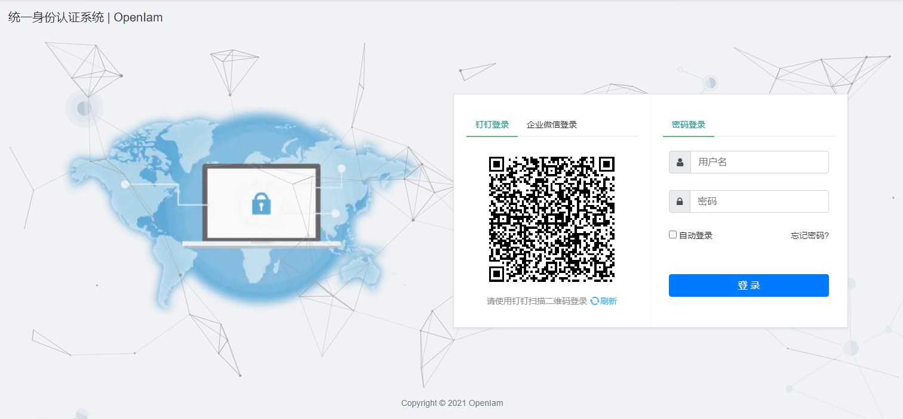
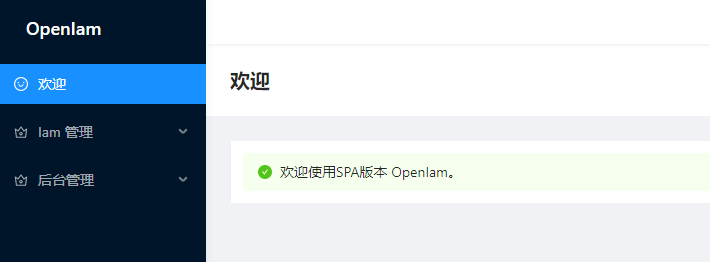
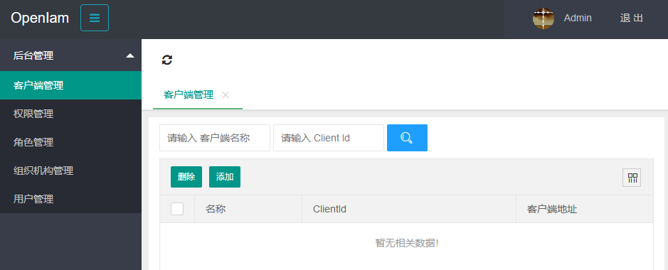
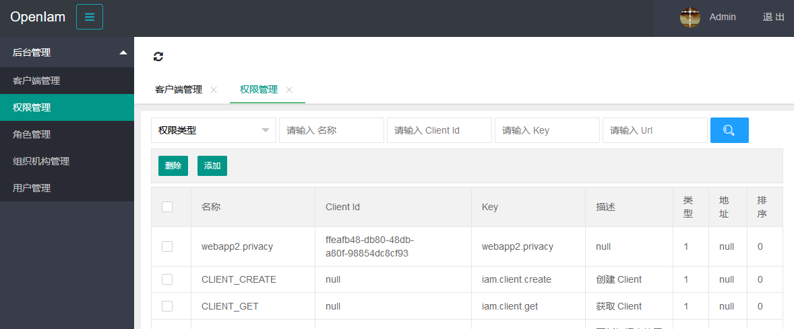

# OpenIam
提供通用的 Iam 解决方案，基于 `Asp.Net Core 3.1`, `EF Core 3.1`, `IdentityServer4`, `Layui 2.5.7` 实现。

## 效果图
##### 登录（小屏）
</img>

##### 登录（大屏）
</img>

##### 首页
</img>

##### 客户端管理
</img>

##### 权限管理
</img>

## 使用说明
未完待续
